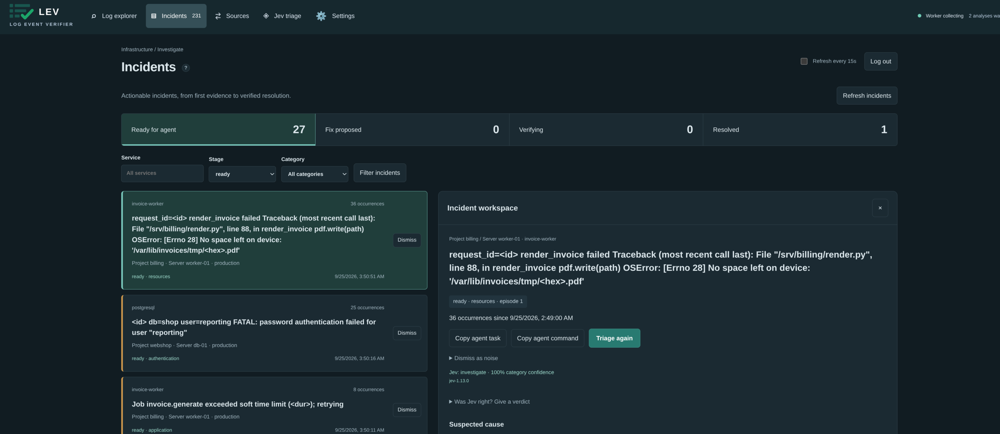
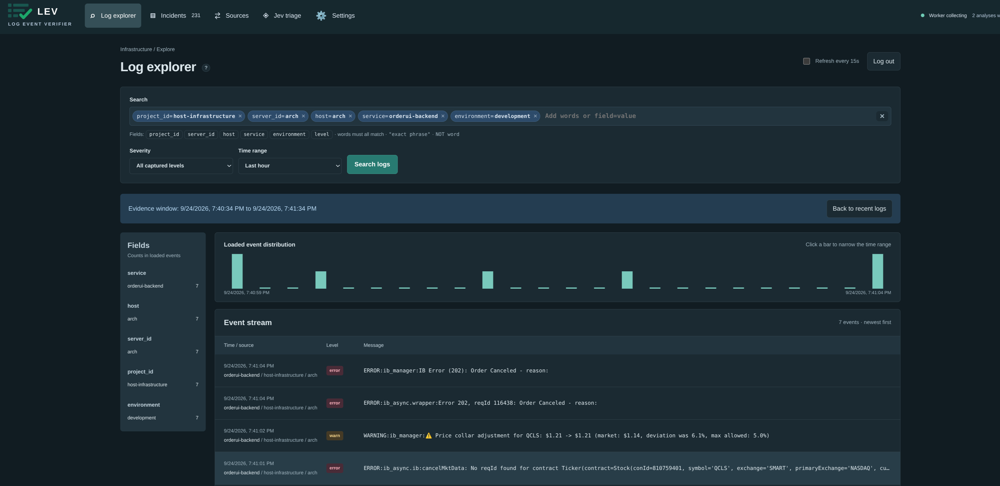
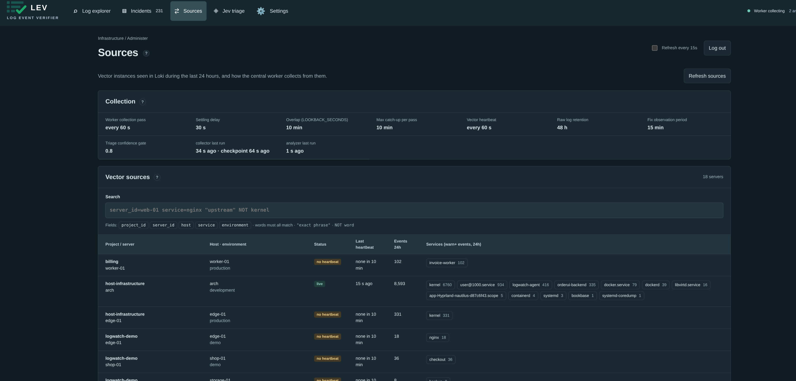
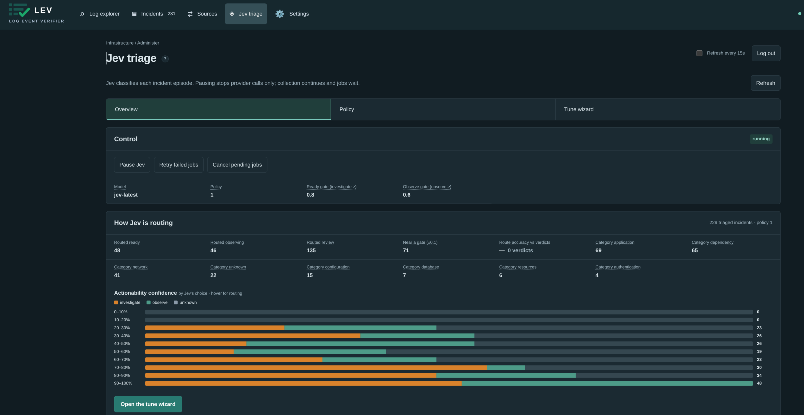

<p align="center"></p>

# Lev: Log Event Verifier

**Lev turns the warnings and errors from your servers into a short queue of incidents, triages them with AI, and only closes one when the fix is proven to hold, so small ops teams stop drowning in logs and stop re-fixing the same problem.**



## One incident, start to finish

1. **Input.** An invoice worker starts failing: `OSError: [Errno 28] No space left on device`, 36 times in an hour, each line with a different request ID.
2. **Lev groups it.** The 36 lines become one incident with a count, not 36 alerts.
3. **Jev triages it.** [Jev](https://typesafe.ai/) (TypeSafe) classifies it as `resources`, actionable, 100% confident, and routes it to **ready**. Uncertain cases go to human review instead.
4. **An agent proposes a fix.** Claude Code with the bundled `lev-agent` skill investigates read-only and submits a diagnosis, the exact changes, acceptance checks and a rollback plan.
5. **You approve.** One click in the UI, bound to that exact proposal.
6. **Lev verifies.** The agent applies the fix and reports its checks. Lev resolves the incident only after 15 minutes without recurrence and with a live heartbeat from the server. If the problem comes back, the incident reopens and old approvals are void.

Lev itself never runs commands or treats log text as instructions.

## Try it with sample data

After the quick start below, open **Settings → Data → Load test data**. It writes an hour of realistic logs from six made-up servers (a database connection storm, a rotated password, a filling disk, a broken staging deploy, firewall noise) and turns them into about 35 incidents. With a TypeSafe API key set, Jev triages them right away; without one, they wait in the queue.

## Quick start

Needs Docker Engine with Compose v2.23 or newer. No git checkout required.

```sh
mkdir lev && cd lev
curl -fsSLO https://github.com/Xvectorio/lev/releases/latest/download/compose.yaml
curl -fsSL -o .env https://github.com/Xvectorio/lev/releases/latest/download/env.example && chmod 600 .env
docker compose up -d
docker compose logs api | grep 'setup code'
```

Expected output:

```
api-1  |   Lev first-run setup code: 3fa1-9c0e-b27d
```

Open http://localhost:8080 (or `http://<server>:8080`), enter the setup code and create your admin account. Then add your TypeSafe API key under **Settings** to turn on triage. This host's own journal is collected immediately; to add more servers, see [Add a source server](docs/guide.md#add-a-source-server).

## Features

- **Incidents, not log lines.** Repeats are fingerprinted (IDs, UUIDs, durations normalized) into one incident with a count.
- **Confidence-gated AI triage.** Jev makes typed, scored judgments on category and actionability. You edit the policy as versioned text and tune the gates against your own verdicts, without extra AI calls.
- **Verified resolution.** Propose, approve, apply, observe. An incident is resolved only when the problem stays gone.
- **Agent-ready, human-approved.** A scoped agent API and a Claude Code skill do the legwork; approval stays with an operator.
- **Log explorer.** Search, field filters and a histogram over recent warn/error/fatal logs.
- **Safe log shipping.** Vector joins stack traces, redacts secrets and forwards only warnings and errors, with a disk buffer.
- **Small footprint.** One `compose.yaml`: Svelte, FastAPI, PostgreSQL, Loki, Vector, Caddy. No Redis, no Celery. Automatic HTTPS, daily backups with a restore check, full audit trail.

| Log explorer | Sources | Jev triage |
|---|---|---|
|  |  |  |

## Documentation

The [operator guide](docs/guide.md) covers everything else: how the pipeline works, accounts and upgrades, adding log sources, the agent API, retention and reliability limits, HTTPS, backups and development.

## License

Copyright (C) 2026 Xvector.

Lev is licensed under the [GNU Affero General Public License v3.0](LICENSE). If you run a modified version as a network service, you must offer its source to its users. Commercial licenses without this obligation are available from Xvector.

Contributions require signing the [Contributor License Agreement](CLA.md); see [CONTRIBUTING.md](CONTRIBUTING.md).
