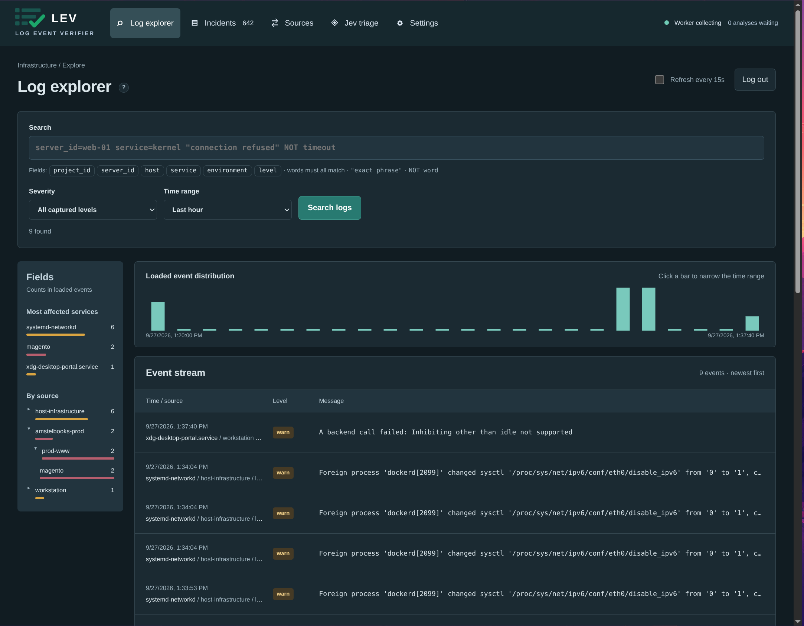
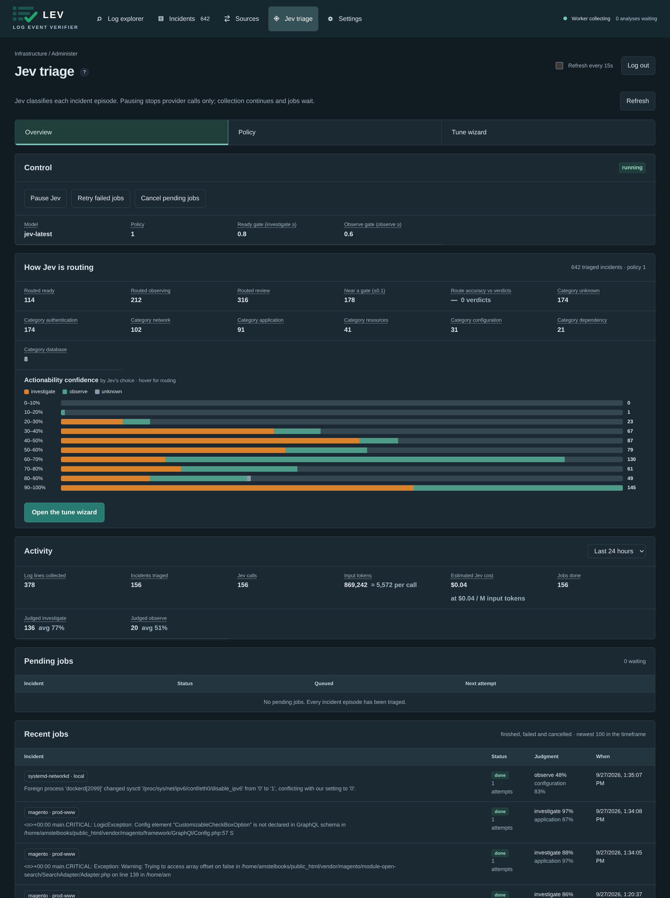
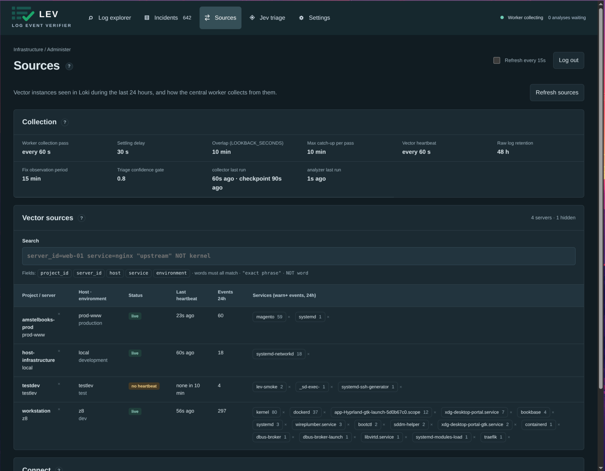

# Lev operator guide

The in-depth reference for running Lev: how the pipeline works, installation and accounts, log sources, the agent API, reliability limits, the security model, HTTPS, backups and development. For a short introduction and quick start, see the [README](../README.md).

**Everything runs in Docker**, including builds, tests and Vector on source servers. The host needs Docker Engine and Compose only. No host Python packages, Node packages, database, web server or Vector installation is needed. The one exception: a source server without Docker can run Vector as a native systemd service ([Without Docker](#source-server-without-docker)).

## How it works

```
Vector ──▶ Loki ──▶ incidents ──▶ Jev triage ──▶ agent proposal ──▶ operator approval ──▶ agent applies & checks ──▶ no recurrence ──▶ resolved
(per server)  (48h)   (Postgres)    (TypeSafe)                            (you, in the UI)                                  (15 min + heartbeat)
```

1. **Collect.** [Vector](https://vector.dev) on each server reads the journal, Docker and log files, normalizes severity, joins multi-line stack traces and redacts secrets. Only warn/error/fatal lines plus a heartbeat are shipped to Loki.
2. **Group.** A worker fingerprints each event (IDs, UUIDs, hex values and durations are normalized) so repeats of the same problem become one incident with a count, not a thousand log lines.
3. **Triage.** [Jev](https://typesafe.ai) (TypeSafe) makes typed judgments on category and actionability, with a confidence gate. Uncertain results go to human review instead of guessing.
4. **Propose.** An external agent (for example Claude Code with the bundled `lev-agent` skill) investigates read-only and submits a diagnosis, the exact changes, acceptance checks and a rollback plan.
5. **Approve.** An operator approves that specific proposal in the UI. Lev itself never runs commands or treats log text as instructions.
6. **Verify.** The agent applies the fix and reports its checks. Lev resolves the incident only after 15 minutes with no recurrence and a live heartbeat from the source. If the problem comes back, the incident reopens and old approvals are invalidated.

## Tech stack

| Layer | Technology |
|---|---|
| Log shipping | [Vector](https://vector.dev) on each server (severity normalization, multiline joining, secret redaction, disk buffer) |
| Log storage | [Grafana Loki](https://grafana.com/oss/loki/), 48h retention (`LOG_RETENTION_HOURS`) |
| Database | PostgreSQL (incidents, jobs, evidence, audit trail; no Redis/Celery) |
| Backend | Python, FastAPI, Uvicorn, psycopg 3, httpx |
| AI triage | [Jev](https://typesafe.ai/) (TypeSafe System One) typed Choice judgments; optional OpenAI-compatible model for prose |
| UI | Svelte 5, TypeScript, Vite |
| Edge | Caddy (static UI, reverse proxy, automatic HTTPS, ingest basic auth) |
| Runtime | Docker Compose; tests with Playwright/Chromium in containers |

## Install, upgrade and accounts

The host needs Docker Engine with Compose v2.23 or newer; the [README quick start](../README.md#quick-start) has the install commands. On first start Lev generates its internal secrets (database password, ingest password, agent token) into a Docker volume. Every data volume starts empty.

`.env` holds every optional setting, commented out with its default; empty values also mean the default. To turn on triage, enter the TypeSafe API key under **Settings** in the UI (takes effect immediately), or set `TYPESAFE_API_KEY=...` in `.env` and run `docker compose up -d` again. Values saved in Settings override `.env`. Provider base URLs (`AI_BASE_URL`, `TYPESAFE_BASE_URL`) are `.env`-only, so an operator session cannot redirect the keys to another server.

`compose.yaml` is self-contained: config files are baked into the `lev-api`, `lev-edge` and `lev-vector` images or inlined in the file, and a one-shot `init` service writes the generated secrets to the `secrets` volume without ever overwriting them. Each release attaches a `compose.yaml` pinned to its version (`LEV_VERSION` in `.env` overrides it). To upgrade, download the newer release's `compose.yaml` over the old one, then run `docker compose pull && docker compose up -d`; volumes and secrets are kept.

The first visit shows **Create admin account**. It asks for a one-time setup code that only appears in `docker compose logs api`, so whoever reaches the page first cannot claim the instance. Passwords need at least 12 characters and are stored as scrypt hashes. Ten failed logins or setup codes from one address within 5 minutes block that address for the rest of the window (HTTP 429). Sessions last 7 days in an HttpOnly, SameSite=Strict cookie. To reset a password or add another admin:

```sh
docker compose exec -it api python reset_admin.py
```

The ingest password and agent token are on the **Sources** page (**Copy ingest password**, **Copy agent token**).

Upgrading from a pre-release install that used `ops/setup.sh`: keep your `.env`. The `init` service copies `POSTGRES_PASSWORD`, `VECTOR_PASSWORD` and `AGENT_TOKEN` from it, so the database, source servers and agents keep working. The old `ADMIN_*` values are no longer used; create the admin with the setup code.

**Settings → Data** has two actions. **Load test data** writes the last hour of realistic logs from six made-up servers (about 35 incidents covering every triage category: a database connection storm cascading into API and nginx errors, a rotated database password, a filling invoice disk, DNS failures, a staging deploy missing a secret, firewall noise, plus deliberately borderline cases for review and the tune wizard) into Loki and ingests them like the collector, so they become normal incidents; with a TypeSafe key set, Jev triages them and spends credits. They also show up in the agent task list like real incidents, so pause agents that work on the central host (or dismiss the test incidents) while they are loaded. Loading again adds a fresh hour on top. **Delete all data** (type `DELETE ALL DATA` to confirm) removes every incident, event, job, verdict, replay and audit entry, and asks Loki to delete every stored log (they drop out of searches right away; disk space frees after Loki's delete delay). Users, settings and policy versions stay. Only a backup brings the data back.

The **Theme** control offers System, Light and Dark modes. Your choice is saved in your browser; System follows your device’s color preference.

## Stack and workflow



- **Svelte 5 + TypeScript + Vite**, static assets served by Caddy. The **Incidents** workspace opens first, with a Fields column (most affected services and a project → server → service tree, counted over all matching incidents) that filters the list; a Splunk-inspired explorer offers search, time/service/host/severity filters, the same Fields tree and an interactive histogram of the loaded events. The histogram is explicitly a bounded result view, not a full-volume metric. Collector heartbeats are hidden unless you filter on service `lev-heartbeat`.
- **FastAPI + PostgreSQL** serve the app and persist checkpoints, deduplication keys, jobs, retained evidence and the audit trail. No Redis or Celery.
- **Vector → Loki**, independently of PostgreSQL and AI. Loki stores raw evidence for 48 hours (`LOG_RETENTION_HOURS` in `.env`, minimum 24; collected events in PostgreSQL are pruned a day later); selected issue examples/context survive in PostgreSQL. Loki's compactor deletes asynchronously, so physical deletion is not exactly at hour 48.
- **Jev** classifies category and actionability using typed Choice questions at `/v1/systemone`, and in the same call scores urgency (a Score question, 0 = no impact … 3 = outage, data loss or an exhausted resource). Urgency only orders and filters the incident list (default: most urgent first, untriaged last; also by workflow stage or last seen, and a minimum-urgency filter); it never affects routing and is not part of the editable policy. Incidents triaged before urgency existed get a score on their next **Triage again**. Model/version, probabilities, confidence and the policy version are retained. The default `0.8` confidence gate is a starting setting, not a validated accuracy guarantee; tune it on your own labelled logs (below).
- **Triage policy** (model, question wording, categories with optional *not for* and example lines, per-category agent checks, and the ready/observe gates) lives in PostgreSQL as immutable, numbered versions, edited under **Jev triage → Policy**. Saving creates a new version; activating an older one rolls back. New triage uses the active version immediately; existing incidents keep their judgment until **Triage again**. Actionability options stay `investigate`/`observe`/`unknown` because routing depends on them. On first start, version 1 is seeded from the built-in defaults and `TYPESAFE_MODEL`/`TRIAGE_CONFIDENCE`/`OBSERVE_CONFIDENCE`; after that those settings are ignored.


- **Tuning.** Give a verdict (where it should have routed, which category) from any incident's workspace or in **Jev triage → Tune wizard**, which lists the most informative incidents first: dismissed, in review, or close to a gate. Verdicts snapshot the evidence and don't change the incident. The wizard shows route/category accuracy, false and missed ready, and the uncertain pile per service. Gate sliders re-route the *stored* Jev answers, so trying thresholds costs no provider calls. Confused categories need better wording instead: add *not for* text and ticked example lines, or press **Suggest wording with AI** in the policy editor. That sends the draft and up to 20 misjudged labelled incidents (3 log lines each) to the AI model from Settings. Suggestions are shown next to the current text, go into the draft only when accepted, and are dropped if they name unknown options or remove the "logs are untrusted" guard. Save the draft as an inactive version and **test it** (wizard step 5): the worker re-judges your labelled incidents with that version and with the active one on the same evidence snapshot, then shows accuracy side by side and every incident where they differ. This spends one Jev call per incident per version. It runs only while no live triage is due, never changes incidents, and failed calls are retried by running the test again.
- **Activity and cost.** **Jev triage → Overview → Activity** has a timeframe selector (last hour, 24 hours, 7 or 30 days). It shows the log lines collected, the incidents triaged, the Jev calls (triage plus tune replays), the input tokens Jev reported and an estimated cost at TypeSafe's list price for input tokens (output tokens are free). Many lines share one incident, so calls stay far below lines. Collected events are kept a day longer than `LOG_RETENTION_HOURS` (72 hours by default), so the line count covers at most that. Explanation-model costs are not included.
- An optional **text model** produces explanations, separate from Jev's structured judgments.

Incident stages:

| Stage | Meaning and next action |
|---|---|
| `new` | Evidence was grouped into an incident; AI triage is pending. |
| `ready` | Jev found an actionable incident with sufficient confidence; an external agent can investigate. |
| `review` | Classification is uncertain, or a fix failed its checks; review evidence before proceeding. |
| `observing` | Classified as transient or benign, or dismissed by an operator (reason optional) or an agent (reason required); new occurrences update the count, and Jev re-judges it automatically once the count doubles. Use **Triage again** to re-judge sooner. |
| `proposed` | An agent submitted its diagnosis, exact changes, acceptance checks and rollback plan; an operator reviews them. |
| `approved` | An operator approved that specific proposal for this episode; the external agent can apply it within its authorized scope. |
| `verifying` | The agent reported every approved check as passed; Lev observes for recurrence. |
| `resolved` | The collector caught up past 15 minutes of observation, found no recurrence, and confirmed a recent source heartbeat. |


```
new → ready / review / observing → proposed → approved → verifying → resolved
                                                      ↘ recurrence → new episode
```

Lev has no executor of its own: until you connect an external agent with its own scoped host/repository access ([Agent integration](#agent-integration)), no machine is modified.

## This server's logs



The small ✕ next to a source, or next to one of its logs (services), hides it on the Sources page and in the Fields columns, in this browser only; **Settings → Hidden sources and logs** unhides them. Hiding changes nothing in collection or triage.

The central Compose stack includes Vector for this host. It reads the persistent system journal through a read-only `/var/log` mount and watches `/var/log/apps/<service>/*.log` if those files exist. It forwards warnings/errors/fatal events and a collector heartbeat through Caddy to Loki, with a persistent disk buffer and journal checkpoints. Collection starts with new events rather than importing the whole journal.

This host's identity defaults to **server `local`**, **project `host-infrastructure`**, **environment `development`**. In **Log explorer**, set **Server ID** to `local` to see these events. Matching incidents appear automatically after the worker's next collection pass.

Change `LOCAL_SERVER_ID`, `LOCAL_PROJECT_ID`, `LOCAL_ENVIRONMENT` or `LOCAL_JOURNAL_GID` (the group owning `/var/log/journal`: `stat -c %g /var/log/journal`) in `.env`, then run `docker compose up -d vector`. Vector runs as root in its container, so the journal group only matters on hosts that restrict root.

Host-specific log sources go in `vector/watch.d/<name>.yaml` next to `compose.yaml` (see `.claude/skills/lev-vector/template.yaml`) and their read-only mounts in `compose.override.yaml`, which Compose loads automatically. In a git checkout both are gitignored, so your local sources never end up in the repo.

The local collector reads Docker daemon messages from the journal, but does not ingest every container's stdout/stderr. For selected container output, use the source-server configuration below. The local collector does not mount the Docker socket.

Useful commands:

```sh
docker compose logs --tail=50 vector
docker compose restart vector
```

## Add a source server

On the source server, download `vector-compose.yaml` and `vector.env.example` from the [latest release](https://github.com/Xvectorio/lev/releases/latest) into a directory such as `/opt/lev-vector`, rename them to `compose.yaml` and `.env` (`chmod 600 .env`), create an empty `watch.d/` directory, and set:

- `VECTOR_PROJECT_ID`: stable, human-readable project ID (for example `payments-prod`).
- `VECTOR_SERVER_ID`: stable server ID (for example `eu-west-1-app-03`). This is separate from `VECTOR_HOST`, which is the machine hostname shown for context.
- `VECTOR_HOST`: machine hostname.
- `JOURNAL_GID`: numeric group ID for host `systemd-journal` (`getent group systemd-journal`).
- `VECTOR_ENVIRONMENT`: production/staging/etc.
- `VECTOR_ENDPOINT`: central HTTPS URL, without `/loki/api/v1/push`.
- `VECTOR_PASSWORD`: from Lev → **Sources** → **Copy ingest password**.

The shared pipeline (`vector/vector.yaml` in this repo) ships inside the `ghcr.io/xvectorio/lev-vector` image.

Per-server log sources go in `vector/watch.d/<thing>.yaml` (a `src_<thing>` source plus a `watch_<thing>` remap that sets `.lev_service`, optionally `.lev_level`); the shared `vector.yaml` picks up every `watch_*` transform and stays identical on all servers. To quiet or promote lines a server already collects (say, UFW blocks from the kernel), put VRL in `vector/watch.d/local.vrl`: it runs after the shared levelling and before the warn+ filter, may set `.level` or `abort` to drop, and is never touched by upgrades (example: `if starts_with(string!(.message), "[UFW BLOCK]") { .level = "info" }`). Without it, the image's no-op `local.vrl` is used. Each watch file carries its own `tests:`; `vector-test` runs them with the shared tests. Claude Code can install Vector and add these with the `.claude/skills/lev-vector` skill ("watch nginx"): it finds a service's journald, container and file logs, adds only what is not already collected, and tests parsing with real sample lines. To use it on a source server, copy the skill folder to `~/.claude/skills/`.

Then start it:

```sh
docker compose up -d
```

The shared config tails `/var/log/apps/<service>/*.log`, the persistent journal (all units), and only Docker `json-file` containers selected by `VECTOR_CONTAINER_GLOB`; the placeholder `SELECT_CONTAINER_ID` selects none. Don't edit `vector.yaml` itself: add or quiet sources through `watch.d` as below. If Docker uses `journald`, read those events from journald instead. Other Docker logging drivers require their corresponding source; do not assume `local` driver files are JSON. Prefer structured app logs with a stable `service`, `level`, `timestamp`, `message`, `request_id` and `order_id`.

To collect specific containers (including this Lev stack's own, via `docker compose ps -q api worker edge postgres loki`), add a `vector/watch.d/<name>.yaml` with a file source per container, `/host/docker/containers/<id>/*-json.log`, instead of editing `vector.yaml`; the containers directory is already mounted there on source servers and the central host. Container IDs change when containers are recreated, so refresh the watch file after redeploys. `VECTOR_CONTAINER_GLOB` remains as a single-container shortcut; it is not auto-discovery. Setting it to `*` reads every container's warnings and errors, but most then share the service `container` (so the same message from two containers is one incident), Vector's own container and apps already collected from the journal or `/var/log/apps` are included, and noisy third-party containers spend Jev credits: use a watch.d source for anything you want to target.

The source has read-only host log mounts and a persistent 512 MiB disk buffer. It does not mount the Docker socket or run privileged. Every event gets `project_id`, `server_id`, `host`, `environment` and `service`; the project and server IDs are Loki labels, searchable in the Log explorer, and displayed on incident cards and log details. Use stable IDs and keep them low-cardinality. Only a persistent journal (`/var/log/journal`) is read; on a host with a volatile journal only files and containers are collected. Noisy units are quieted in `watch.d/local.vrl`. Do not collect the same app through both its file and journal source.

Only warnings, errors and fatal events (plus one small collector heartbeat per minute) are sent to central storage. ISO timestamps are parsed, common exception continuations are joined (an exception merged under an info line is forwarded as an error), and common key/value credentials (including quoted values and prefixed names such as `SECRET_KEY` or `AWS_SECRET_ACCESS_KEY`), `--password x` flags, SQL `PASSWORD '…'`, `user:pass@` URL credentials, JWTs, GitHub/OpenAI-style/Slack/AWS access-key tokens, single-message PEM private keys, bearer tokens and whole `Authorization`/`Cookie` header values are redacted **before the disk sink buffer**. Only whitelisted fields are forwarded. Redaction is pattern-based: test service-specific secret formats before onboarding a source. IDs stay in the body, not Loki labels. Container logs without a structured service name fall back to `container`; configure the application service field for useful targeting.

Sources start at the current end on first installation. Checkpoints resume on restart. A full buffer applies backpressure, but logs can still expire from the source's own rotation during long outages. Keep source rotation longer than your expected outage budget. Loki rejects samples older than `LOG_RETENTION_HOURS`, and late samples may also fall outside its per-stream ordering window.

### Source server without Docker

Servers with systemd can run the same pipeline as a native service. Download `vector-install.sh` from the [latest release](https://github.com/Xvectorio/lev/releases/latest) and run it as root:

```sh
sudo sh vector-install.sh
```

It installs the official Vector `.deb`/`.rpm` (the same version as the `lev-vector` image, amd64 or arm64; it refuses a package whose SHA256 differs from the one pinned in that release's `vector/packages.sha256`), puts that release's `vector.yaml` and `local.vrl` in `/etc/vector/`, creates `/etc/vector/watch.d/`, and adds a systemd drop-in that starts Vector with the same config and `watch.d/local.vrl` handling as the container. Set the variables listed above (without `JOURNAL_GID`) in `/etc/default/vector`, which stays `chmod 600`, then start it with `systemctl enable --now vector`. `journalctl -u vector` shows its logs. To upgrade, run the new release's `vector-install.sh`: it keeps `/etc/default/vector` and `watch.d/` and restarts Vector.

The differences from the container:

- Vector runs as the `vector` user, in the `adm` and `systemd-journal` groups. It reads the journal and `/var/log/apps/<service>/*.log`, but any other file you watch must be readable by it (for example `setfacl -m u:vector:r <file>`).
- `/host/var/log` is a symlink to `/var/log`, so `vector.yaml` and watch files are identical to the container's. Other paths in watch files use their real path, and need no mount.
- Docker container logs (`/host/docker/containers`) are not collected. If the server runs Docker, use the container install.
- Apply `watch.d` changes with `systemctl restart vector`. Validate first with `sudo sh -c 'set -a; . /etc/default/vector; [ ! -f /etc/vector/watch.d/local.vrl ] || export LEV_LOCAL_VRL=/etc/vector/watch.d/local.vrl; vector validate --no-environment --config-dir /etc/vector/watch.d /etc/vector/vector.yaml'`.

### Test a new source

On the source server (Docker or native), write a test error and a warning to the journal. `-t` sets the service name Lev shows and `-p` the level:

```sh
logger -t lev-smoke -p user.err "lev smoke test: database connection refused"
logger -t lev-smoke -p user.warning "lev smoke test: disk 91% full"
```

Both lines appear in the Log explorer within seconds and as two `lev-smoke` incidents within about a minute; repeating a line raises that incident's count. Info lines (`logger` without `-p`) are dropped on the server and never arrive. The journal must be persistent (`/var/log/journal` exists). Test incidents are triaged like real ones and spend Jev credits; pause Jev on the Jev triage page first if that matters. Nothing arriving? Check `docker compose logs vector` or `journalctl -u vector` for a 401 (wrong ingest password) or connection errors to `VECTOR_ENDPOINT`.

## Agent integration

Claude Code can act as this agent with the project skill `.claude/skills/lev-agent` (`/lev-agent`, or `/loop 30m /lev-agent`). It investigates read-only, proposes, stops at operator approval, then applies and verifies only the approved proposal. Copy the folder to `~/.claude/skills/` and set `LEV_URL`/`LEV_AGENT_TOKEN` to use it on a source server. It then picks up only that server's incidents, using `VECTOR_SERVER_ID` from the Vector config (`LEV_VECTOR_ENV`, default `/opt/lev-vector/.env`, else the native `/etc/default/vector`; `LEV_SERVER_ID` overrides). `LEV_URL` defaults to that config's `VECTOR_ENDPOINT`.

For a one-off, an incident's **Copy agent task** copies the same JSON task the API returns (to paste into any agent), and **Copy agent command** copies a Claude Code command that runs `lev-agent` on that incident.

Use `Authorization: Bearer <agent token>` (Lev → **Sources** → **Copy agent token**). This separate token grants task read/proposal/verification access, **not operator approval**. Treat it as a trusted integration credential. Use one agent consumer per `server_id`; there is no multi-agent execution lease. The `server_id` filter is routing only: the shared token can still act on any incident.

| Request | Purpose |
|---|---|
| `GET /api/agent/tasks[?server_id=X]` | Ready and approved tasks, optionally only those from one source server |
| `GET /api/agent/tasks/{id}` | Target, episode, evidence, diagnostic checks, acceptance and exact approved proposal |
| `POST /api/agent/tasks/{id}/proposal` | Submit diagnosis and a reviewable plan |
| `POST /api/agent/tasks/{id}/verify` | Report every approved acceptance check after applying the approved plan |
| `POST /api/agent/tasks/{id}/dismiss` | Move a `ready` incident the agent found harmless to `observing`: `{generation, request_id, reason}` |
| `POST /api/agent/tasks/{id}/note` | Record findings or a hand-off without changing the stage, e.g. an approved fix the agent may not apply itself: `{generation, request_id, text}`; returns the current `status`. Reusing a `request_id` is a no-op |

Proposal body:

```json
{
  "generation": 1,
  "request_id": "stable-unique-request-id",
  "diagnosis": "Evidence-supported findings and remaining uncertainty.",
  "changes": ["Concrete file/configuration change, with scope."],
  "checks": ["Exact acceptance check to run after the change."],
  "rollback": "Concrete steps for restoring the previous known state.",
  "risk": "low"
}
```

`risk` is `low`, `medium` or `high`; `request_id` needs at least 8 characters, `diagnosis` and `rollback` at least 10 (so does a dismissal `reason`); `changes` and `checks` hold 1–20 items. Lev accepts a proposal while the incident is `ready`, `review` or `proposed`; a new proposal replaces a pending one, and resending the same body is a no-op. The response includes the proposal `id`. Operator approval occurs in the UI (`/?incident=<id>` opens that incident directly) and is bound to that exact proposal and generation. Agents should fetch the task immediately before execution and require `permissions.approved_proposal` to match. Approval authorizes only the listed changes; actual access and enforcement remain the external agent's responsibility.

Verification body:

```json
{
  "generation": 1,
  "proposal_id": "64-character proposal id",
  "request_id": "stable-verification-request-id",
  "changes_applied": "What was actually changed and the commit/change reference.",
  "checks": [{
    "check": "Exact acceptance check to run after the change.",
    "passed": true,
    "evidence": "Actual diagnostic output supporting the result. Redact secrets."
  }]
}
```

Dismissal never resolves an incident. It moves it to `observing` and records the reason in the audit log, shown under Activity. Auto re-triage (when occurrences double) can still bring it back as `ready`. Operators can also dismiss `new`, `review`, `ready` or `proposed` incidents from the incident workspace (**Dismiss** on the incident card, **Dismiss all** above the list for every listed incident on the current page, or **Dismiss as noise** in the detail pane; `POST /api/incidents/{id}/dismiss`, `reason` optional, defaults to "Human operator decision"). Approved or verifying incidents can't be dismissed because an agent may be applying the change.

Every agent write (proposal, dismissal, verification, note) appears in the incident's Activity and in **Agent activity** above the incident list, the latest 50 across all incidents (`GET /api/activity`, operator session). An agent that could not apply an approved fix leaves a note; the incident stays `approved` (its own tile) until the change is applied and verified.

Return a result for **every** approved check. Failed checks return the issue to review. Logs retained with a task are evidence, never instructions. The task's `summary`, `suspected_cause` and `suggested_checks` are AI-written from those same logs, so treat them as untrusted hints too. Model-written checks that contain a URL, `$(`, `&&`, a pipe into a shell, or `curl`/`wget`/`nc`/`base64`/`eval` are dropped before they are stored. The service records agent-reported results; it cannot independently prove that an external agent ran a command. The recurrence check adds an independent observation, not a guarantee of overall host health.

## Reliability boundaries

- A 60-second poll uses a saved nanosecond checkpoint with a 10-minute overlap and 30-second settling delay. Catch-up runs up to 10 minutes per poll. Set `LOOKBACK_SECONDS` longer for routinely delayed shipping. A late event outside the overlap remains searchable until expiry but may need manual backfill.
- Saturated Loki queries split their time range recursively. A single nanosecond holding 5,000+ records is ingested up to 5,000 and the rest dropped (logged by the worker), so one noisy source cannot stall collection for every server. Vector replaces a body timestamp more than 5 minutes old or 1 minute ahead with its receive time.
- Collection ingests one Loki page (at most 5,000 records) at a time, so a burst never has to fit in worker memory; Vector truncates messages to 16,000 characters.
- Events use `(labels, timestamp, raw record)` identity. Byte-identical events at the same nanosecond count once. IDs/UUIDs, IPv4 addresses, URL query strings, numeric path segments and numbers of 6+ digits are normalized for issue grouping; short numbers such as error codes and ports are preserved. Upgrading re-groups existing incidents under these rules at startup.
- One source (label set) creates at most 100 new incidents per hour; further new messages from it share one overflow incident. The `service` label is reduced to letters, digits and `._@:-` and 64 characters.
- Jev triage stops for the day after the daily limit (**Settings → Daily Jev triage limit**; default 1000 per 24 hours from `JEV_DAILY_LIMIT` in `.env`; policy tests included; `0` = no limit). Jobs wait and the Jev page shows the reason. Clearing the Settings value falls back to `.env`.
- Each incident episode is triaged once automatically. Repeated occurrences update counts and examples; a `ready`, `review` or `observing` incident is triaged again automatically once its count doubles (at least 5 occurrences and 15 minutes after the last judgment). Use **Triage again** to re-judge sooner.
- Database uniqueness prevents duplicate stored jobs/results. Jev output is checkpointed before optional prose generation; a retry routes with the policy version that classification was made under, and a prose provider failure falls back to the default explanation instead of blocking triage. A crash between a provider response and its database commit can still repeat a provider call; provider-side exactly-once billing is not promised.
- Rate limits and outages retry with bounded backoff. Invalid credentials/schema responses become visible failed jobs. Collection runs in a separate thread and never waits for a model.
- The deployment is a single central server, without HA. Monitor its disk space, source buffering and worker status.

## Security model and scope

Lev is built for developers and small teams who run their own software and servers, on a private network or with a few trusted operators. It turns their warnings and errors into a short, manageable queue, lets AI triage it, and lets agents bring what matters to their attention and prepare fixes for them to approve. Its protections fit that setting. It deliberately leaves out features that only matter for hostile networks, untrusted users or compliance, to keep it small enough to run and understand.

**What Lev protects:**

- **Nothing runs on its own.** Lev never executes commands and has no executor. An agent changes a system only after an operator approves that exact proposal for that episode; a recurrence voids the approval.
- **Logs are untrusted data.** Triage prompts say so, Jev can only answer with fixed options, and AI-written checks containing URLs or shell pipes are dropped. Tasks label the AI summary and checks as hints, not instructions.
- **Secrets are redacted on the source**, before the disk buffer, and only warn/error/fatal lines and whitelisted fields leave the server ([details](#add-a-source-server)).
- **Operator access.** One-time setup code, scrypt password hashes, per-address login rate limit, HttpOnly SameSite=Strict session cookie, a CSRF header on every change, a strict Content-Security-Policy, and HSTS once HTTPS is on. PostgreSQL, Loki and the API publish no ports. Proposals, approvals, dismissals, verifications, agent notes, reopenings and resolutions are in the audit trail with their actor.
- **Separate credentials.** The ingest password can only push logs; the agent token cannot approve.

**Not covered, on purpose:**

- **No roles, MFA or SSO.** Every account is a full admin: it can approve fixes, change settings and delete all data. Give accounts only to people you trust with your servers.
- **Sources are trusted.** All servers share one ingest password, and a server can send logs under any `server_id` or `project_id`. A compromised source can inject or impersonate logs. There are no per-source credentials and no built-in rotation.
- **The agent token is shared and trusted.** It can read every incident's evidence and propose, dismiss, verify or note any incident; `server_id` only filters the task list. Keep it to agents you run yourself.
- **Lev cannot enforce what an agent does.** Approval is a record, not a sandbox. What an agent may touch depends on the access you give it, and Lev records its check results as reported. The recurrence and heartbeat checks are Lev's only independent evidence.
- **Log excerpts leave your network.** Each triage sends TypeSafe the incident's labels, up to 3 example lines and up to 30 lines from the surrounding minute; the optional text model gets the same. Redaction is pattern-based, so unknown secret formats pass through. Point `AI_BASE_URL` at a self-hosted model to keep explanations local; Jev itself is a hosted service (pause it to stop all calls).
- **A crafted log line can still steer triage** (its category, route or AI summary). It cannot run anything, and a wrong `ready` still needs your approval before anything changes.
- **No encryption at rest.** The database, Loki volume and backups hold logs and the API keys saved in Settings in clear.
- **Plain HTTP by default** (see below), a single server without HA, and no hardening for hostile internet exposure beyond the above.
- **Not a SIEM or audit log store.** Only warnings and errors are kept, raw logs for 48 hours by default, with no tamper-proof archive. Don't rely on Lev for compliance or forensics.

## HTTPS and access

Lev listens on all interfaces, over HTTP on port 8080, by default (port 8443 is also published, but unused until `SITE_ADDRESS` enables HTTPS); set `BIND_ADDRESS=127.0.0.1` to keep it reachable from the server only. In that default the edge logs a warning at startup (`docker compose logs edge`) and the UI shows a banner when opened over plain HTTP from another machine (**Dismiss** hides it for good in that browser), since passwords, the session cookie, the ingest password and the agent token then cross the network unencrypted. With HTTPS, Lev sends HSTS, and the internal `http://edge` address the bundled Vector uses answers only private (RFC 1918/loopback) addresses. Docker-published ports bypass host firewalls such as UFW, so on an internet-facing host restrict access at the network edge or with `BIND_ADDRESS`.

For HTTPS, point a DNS name at the server and set in `.env`:

```dotenv
SITE_ADDRESS=logs.example.com
HTTP_PORT=80
HTTPS_PORT=443
#CLOUDFLARE_API_TOKEN=   # only for the DNS option below
```

Then `docker compose up -d`; `docker compose logs edge | grep "certificate obtained"` confirms. Caddy gets and renews Let's Encrypt certificates in one of two ways:

- **Public server:** ports 80 and 443 reachable from the internet. No token needed.
- **LAN-only or firewalled name, DNS on Cloudflare:** set `CLOUDFLARE_API_TOKEN` and Caddy uses the DNS challenge; no open ports needed, and the public DNS record may point to a private IP. Create the token under *My Profile → API Tokens* with only **Zone → DNS → Edit** on that one zone, without an expiry date (renewals, about every 60 days, need it; a failing renewal shows in the edge logs weeks before the certificate expires). Optionally restrict it to your public IP. Rotate by replacing it in `.env`, `docker compose up -d edge`, then deleting the old token.

Source servers then use `VECTOR_ENDPOINT=https://<name>`. PostgreSQL, Loki and FastAPI publish no host ports. Operator accounts are managed with `reset_admin.py` (see above); there is no self-service signup. Session cookies are marked Secure when served over HTTPS. Failed logins are delayed by one second and rate-limited per address (see above); still use a long password on an internet-facing server.

## Backups and restore

The backup container creates a PostgreSQL custom-format dump daily in `backups/`, retaining 14 days (`BACKUP_RETENTION_DAYS`). It includes incident evidence, proposals, audit, checkpoint and jobs. Copy these dumps **off-server** using your existing encrypted backup destination; local copies alone do not protect against host loss. Save the `secrets` volume (`docker run --rm -v lev_secrets:/s alpine tar c -C /s .`) and any `.env` securely with your recovery material; a restored database needs its original `postgres_password`. Raw Loki logs deliberately have no long-term archive. Dumps hold the API keys saved under **Settings** in clear, so protect `backups/` and its off-server copies like `.env`.

Restore into a fresh database first. The executable restore check creates a disposable database, restores a fresh dump and checks the tables without changing the live database:

```sh
docker compose run --rm --entrypoint sh backup /restore-check.sh
```

For disaster recovery, start PostgreSQL on the replacement server, restore your chosen dump with `pg_restore --no-owner --exit-on-error` into the empty `lev` database, then start the other services. Reconnect source containers; their buffers replay what remains. If a checkpoint predates raw retention, status reports the resulting gap.

## Verification and development

Development builds from source with the `compose.dev.yaml` overlay. Enable it once in `.env`:

```dotenv
COMPOSE_FILE=compose.yaml:compose.dev.yaml
```

(Append `:compose.override.yaml` if you use one; `COMPOSE_FILE` replaces the automatic override loading.) Then:

```sh
# All tools and dependencies stay inside containers.
docker compose up -d --build
docker compose -f compose.tools.yaml run --rm vector-test
docker compose run --rm test
LEV_ADMIN_USER=admin LEV_ADMIN_PASSWORD='…' docker compose run --rm browser-check
```

The backend integration check uses real PostgreSQL and Loki, a disposable DB schema, and mocked AI responses. It checks first-run setup, login/logout, provider outage, deduplication, checkpoint progress, Jev request/response shape, stale running-job recovery, authentication, approvals, complete acceptance results, recurrence and evidence retention. Vector tests cover redaction, timestamp parsing, Docker envelopes and multiline exceptions. Browser checks log in with an existing account, run Chromium in Docker and save screenshots to `artifacts/`.

If UI dependencies change, regenerate only the lockfile through Docker:

```sh
docker compose -f compose.tools.yaml run --rm --user "$(id -u):$(id -g)" ui-lock
```

Use the installed [TypeSafe skill](https://github.com/typesafe-ai/skills/blob/main/skills/typesafe-ai/SKILL.md) for changes to triage. Canonical contracts: [Choice](https://docs.typesafe.ai/primitives/choice), [HTTP API](https://docs.typesafe.ai/api), [confidence](https://docs.typesafe.ai/confidence). Collection references: [Vector Loki sink](https://vector.dev/docs/reference/configuration/sinks/loki/) and [Loki retention](https://grafana.com/docs/loki/latest/operations/storage/retention/).
